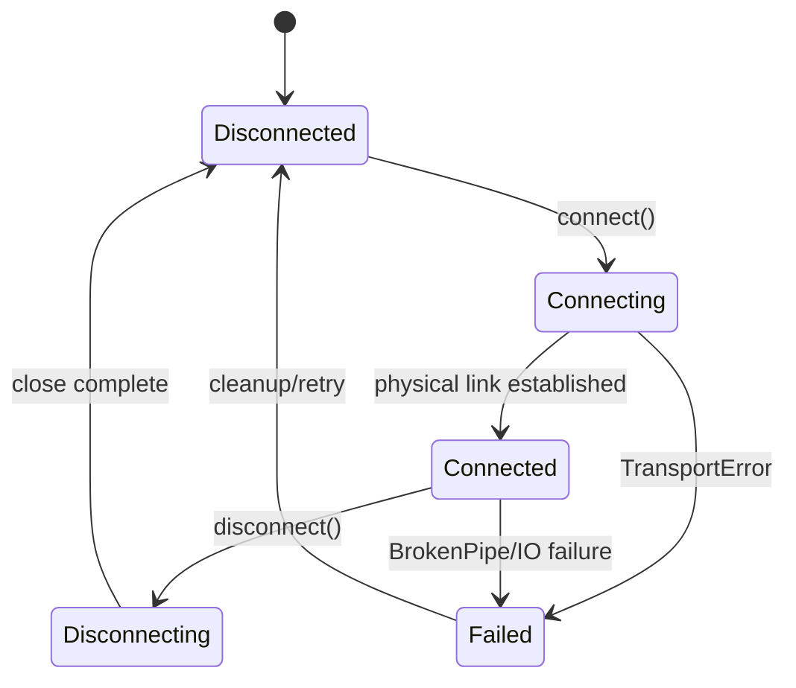
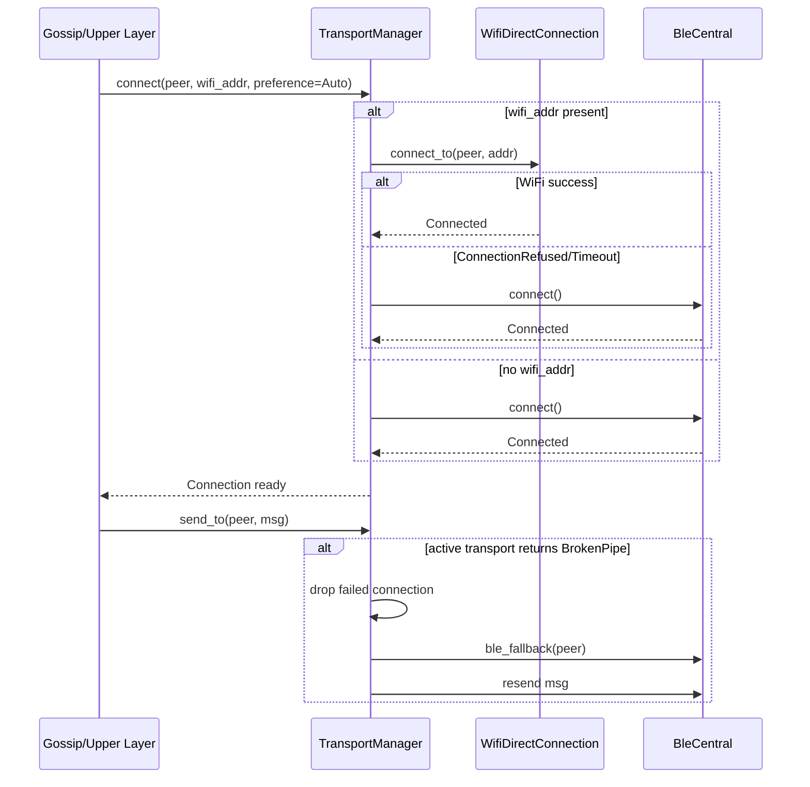
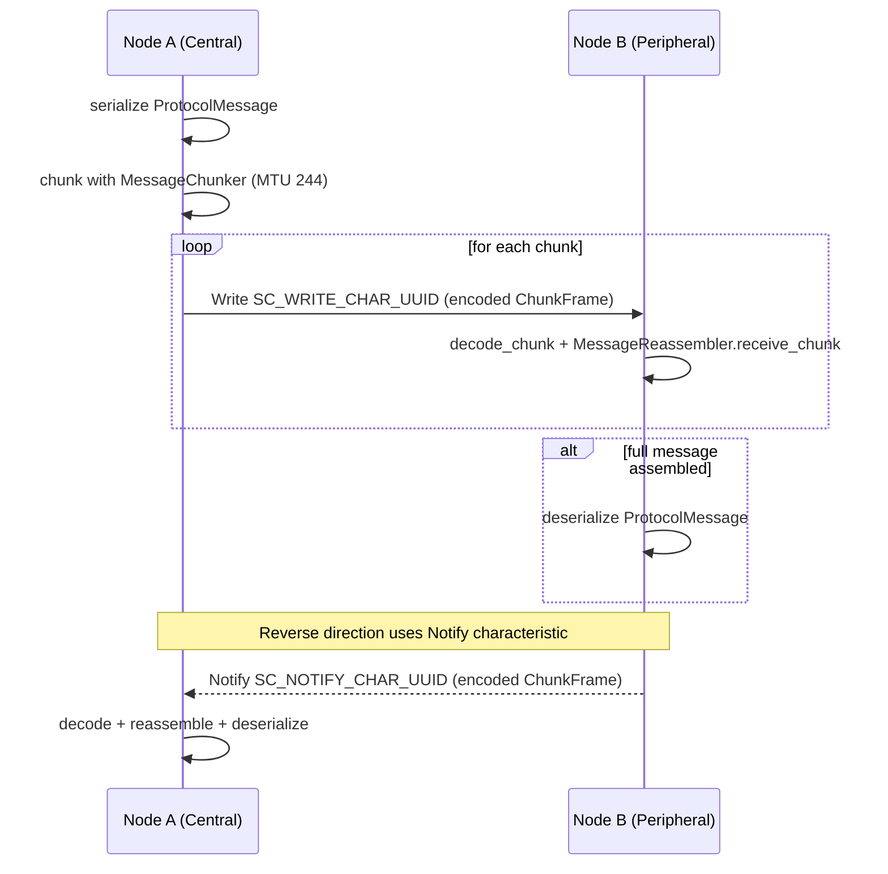

# Transport Layer Deep-Dive

This document explains how `src/transport/` hides BLE GATT and WiFi-Direct TCP details behind one `Connection` interface used by upper layers (for example gossip).

## 1) Unified Transport Abstraction

The upper networking layers only depend on the `Connection` trait (`src/transport/connection.rs`):

- `remote_peer() -> PeerIdentity`
- `transport_type() -> TransportType` (`Ble` or `WifiDirect`)
- `state() -> ConnectionState`
- `connect()`
- `send(msg)`
- `recv()`
- `disconnect()`

### Connection Lifecycle (`ConnectionState`)

`ConnectionState` is shared across BLE and WiFi implementations:

- `Disconnected`
- `Connecting`
- `Connected`
- `Disconnecting`
- `Failed(TransportError)`

Current backend implementations mainly transition between `Disconnected` and `Connected` in core paths, but they expose the full state enum for richer runtime transitions.

## 2) TransportManager Selection and Fallback

`TransportManager` (`src/transport/unified.rs`) stores one active connection per peer pubkey and chooses hardware based on `TransportPreference`:

- `WifiOnly`
- `BleOnly`
- `Auto`

Selection logic in `connect(peer, wifi_addr)`:

- `WifiOnly`: requires `wifi_addr`; connects with `WifiDirectConnection::connect_to`.
- `BleOnly`: skips WiFi and connects with `BleCentral::scan_and_connect`.
- `Auto`:
  - if `wifi_addr` exists, try WiFi first.
  - fallback to BLE only when WiFi connect returns `ConnectionRefused` or `Timeout`.
  - if no `wifi_addr`, go directly to BLE.

Runtime fallback during active sessions:

- `send_to`: on `BrokenPipe`, remove failed connection, reconnect via BLE, retry send.
- `recv_any`: on `BrokenPipe`, remove failed connection, attempt BLE reconnect.

## 3) Message Framing and Chunking

Both BLE and WiFi transports use the same chunk format (`ChunkFrame`) to carry serialized `ProtocolMessage` bytes.

### Why chunking exists

- BLE ATT payload is constrained by MTU. This code uses `BLE_ATT_MTU = 244`.
- A `ChunkFrame` adds a 14-byte header.
- Effective payload per BLE chunk is `244 - 14 = 230 bytes`.

For WiFi TCP, `WIFI_TCP_MTU = 1448`; the same frame format is used for consistency.

### ChunkFrame Header Layout (14 bytes)

All integer fields are little-endian.

| Byte Range | Field | Type | Meaning |
|---|---|---|---|
| `0..4` | `message_id` | `u32` | Random ID shared by all chunks in one logical message |
| `4..8` | `total_length` | `u32` | Total serialized message length in bytes |
| `8..12` | `offset` | `u32` | Start index of this payload in the full message |
| `12..14` | `payload_size` | `u16` | Number of payload bytes in this chunk |
| `14..` | `payload` | `Vec<u8>` | Raw chunk payload |

### Reassembly behavior

`MessageReassembler` keeps per-`message_id` buffers:

- Allocates `data` and `received_map` sized to `total_length`.
- Accepts out-of-order chunks by writing bytes at `offset..offset+payload_size`.
- Tracks `received_bytes`; completes when all bytes are present.
- Rejects invalid chunks (size mismatch, bounds errors, oversized messages).
- Cleans stale partial buffers with `cleanup_stale_buffers(timeout_ms)`.

This is verified by tests in `src/transport/unified.rs`:

- `reassembler_handles_out_of_order_chunks`
- `stale_buffers_are_cleaned_up`
- `oversized_message_is_rejected`

## 4) BLE GATT Model

BLE roles in this project:

- `BleCentral`: GATT client/scanner (initiates, writes to peripheral)
- `BlePeripheral`: GATT server/advertiser (hosts service + characteristics)

Custom UUIDs (`src/transport/ble_transport.rs`):

- Service: `SC_SERVICE_UUID = 00deadbe-efca-feba-be00-000000000001`
- Write characteristic: `SC_WRITE_CHAR_UUID = 00deadbe-efca-feba-be00-000000000002`
- Notify characteristic: `SC_NOTIFY_CHAR_UUID = 00deadbe-efca-feba-be00-000000000003`

### BLE chunk exchange sequence

## 5) WiFi-Direct TCP Fallback

WiFi-Direct group formation (including Group Owner election) is performed by the OS/platform stack outside this module. `wifi_transport.rs` assumes that step is already complete and receives a reachable P2P `SocketAddr`.

### Connection model

- Outbound: `WifiDirectConnection::connect_to(peer, addr)` opens a `TcpStream`.
- Inbound: `WifiDirectConnection::accept_from(listener, remote_peer)` wraps accepted stream.
- Send path:
  - Serialize protocol message.
  - Chunk with `MessageChunker` (`WIFI_TCP_MTU=1448`).
  - For each chunk, write TCP frame: `4-byte LE length prefix + chunk bytes`.
- Receive path:
  - Read one framed payload (`read_frame`).
  - Decode header fields and payload into `ChunkFrame`.
  - Reassemble until complete, then deserialize to `ProtocolMessage`.

### Reconnect behavior

If `connect()` is called while disconnected and an address is known, reconnection uses exponential backoff:

- Base delay: `RECONNECT_BASE_DELAY_MS = 100`
- Attempts: `MAX_RECONNECT_ATTEMPTS = 5`
- Delay doubles each attempt

If all attempts fail, state becomes `Disconnected` and `ConnectionRefused` is returned.

## 6) Practical Notes for Contributors

When modifying `src/transport/`:

- Preserve `Connection` trait semantics: upper layers must remain hardware-agnostic.
- Keep chunk-frame header compatibility across BLE and WiFi backends.
- Update both transport backends if you change framing or chunk validation rules.
- Keep fallback behavior consistent with `TransportManager` (`Auto` selection + BrokenPipe BLE fallback).
- Add or update tests in `unified.rs`, `ble_transport.rs`, and `wifi_transport.rs` for state transitions and framing invariants.
